# PROJECT KNOWLEDGE BASE — Campus Complaints Manager

> **Document Version:** 1.0  
> **Generated:** June 2026  
> **Audience:** New developers, maintainers, and system analysts  
> **Scope:** Complete reverse-engineered documentation of the Campus Complaint Management System

---

## Table of Contents

1. [Executive Summary](#section-1---executive-summary)
2. [Project Architecture](#section-2---project-architecture)
3. [Route Analysis](#section-3---route-analysis)
4. [Authentication & Authorization](#section-4---authentication--authorization)
5. [Database Analysis](#section-5---database-analysis)
6. [Eloquent Relationships](#section-6---eloquent-relationships)
7. [Controller Analysis](#section-7---controller-analysis)
8. [Blade View Analysis](#section-8---blade-view-analysis)
9. [Full Complaint Lifecycle](#section-9---full-complaint-lifecycle)
10. [Middleware Analysis](#section-10---middleware-analysis)
11. [Validation Rules](#section-11---validation-rules)
12. [Business Logic Map](#section-12---business-logic-map)
13. [User Journey Mapping](#section-13---user-journey-mapping)
14. [System Flow Diagrams](#section-14---system-flow-diagrams)
15. [Developer Onboarding Guide](#section-15---developer-onboarding-guide)
16. [File Importance Ranking](#section-16---file-importance-ranking)
17. [Code Smells & Improvement Suggestions](#section-17---code-smells--improvement-suggestions)
18. [Learning Guide](#section-18---learning-guide)

---

# Section 1 - Executive Summary

## Project Overview

| Field | Detail |
|-------|--------|
| **Project Name** | Campus Complaints Manager (CampusTrack) |
| **Purpose** | A web-based platform enabling university students to submit, track, and resolve campus-related complaints (IT issues, maintenance, hostel, security, housekeeping). Staff members resolve assigned complaints, and administrators oversee the entire workflow. |
| **Target Users** | **Students** (submit & track complaints), **Staff** (resolve assigned complaints), **Admins** (manage all complaints, users, departments, categories, reports) |
| **Laravel Version** | **13.x** |
| **PHP Version** | **8.3+** |
| **Database** | **SQLite** (development/testing), configurable for production |
| **Frontend** | **Tailwind CSS v4**, **Livewire 4**, **Flux 2.12** UI components, **Alpine.js** (bundled with Flux) |
| **Testing** | **Pest PHP v4** with in-memory SQLite |

## Key Features

- **Role-based access control** — Three distinct roles: `student`, `staff`, `admin`
- **Complaint lifecycle management** — 8 status stages from submission to closure
- **SLA tracking** — Automatic due-date calculation based on category-specific SLA hours
- **Activity logging** — Full audit trail of every status transition
- **Department & Category management** — Admin-configurable organizational structure
- **Two-Factor Authentication (2FA)** — TOTP-based via Laravel Fortify
- **Internal vs. public comments** — Staff can leave internal notes invisible to students
- **Feedback system** — One rating per resolved complaint
- **File attachments** — Attachable to complaints and comments
- **Auto-generated ticket numbers** — Sequential `CMP-XXXXXX` format

## Third-Party Packages

| Package | Version | Purpose |
|---------|---------|---------|
| `laravel/framework` | ^13.0 | Core framework |
| `laravel/fortify` | ^1.34 | Authentication backend (login, register, 2FA, password reset) |
| `livewire/livewire` | ^4.1 | Reactive PHP components |
| `livewire/flux` | ^2.12.0 | Pre-built UI component library |
| `laravel/tinker` | ^3.0 | REPL for debugging |
| `pestphp/pest` | ^4.4 | Testing framework |
| `laravel/pint` | ^1.27 | Code style fixer (PSR-12 + Laravel preset) |
| `laravel/pail` | ^1.2.5 | Real-time log viewer |
| `laravel/sail` | ^1.53 | Docker development environment |
| `fakerphp/faker` | ^1.24 | Test data generation |
| `tailwindcss` | ^4.2.2 | CSS framework |
| `vite` | ^8.0.0 | Frontend build tool |

---

# Section 2 - Project Architecture

## MVC Architecture Implementation

The project follows Laravel's standard **Model-View-Controller** pattern with additional layers:

- **Models** (`app/Models/`) — Eloquent ORM classes representing database tables
- **Views** (`resources/views/`) — Blade templates organized by role
- **Controllers** (`app/Http/Controllers/`) — Organized into role-specific namespaces
- **Livewire Components** (`app/Livewire/`) — Reactive server-side components for settings/auth
- **Middleware** (`app/Http/Middleware/`) — Request filtering (role-based access)
- **Policies** (`app/Policies/`) — Fine-grained authorization rules
- **Actions** (`app/Actions/`) — Fortify action classes for user lifecycle operations
- **Concerns/Traits** (`app/Concerns/`) — Shared validation logic

## Complete Folder Structure

```
campus-complaints-manager/
├── app/                                    # Application code (PSR-4: App\)
│   ├── Actions/
│   │   └── Fortify/
│   │       ├── CreateNewUser.php           # User registration logic
│   │       └── ResetUserPassword.php       # Password reset logic
│   ├── Concerns/
│   │   ├── PasswordValidationRules.php     # Shared password validation trait
│   │   └── ProfileValidationRules.php      # Shared profile validation trait
│   ├── Http/
│   │   ├── Controllers/
│   │   │   ├── Controller.php              # Abstract base controller (empty)
│   │   │   ├── Admin/
│   │   │   │   ├── CategoryController.php  # CRUD for complaint categories
│   │   │   │   ├── ComplaintController.php # Full complaint management + assign + status
│   │   │   │   ├── DepartmentController.php# CRUD for departments
│   │   │   │   ├── ReportController.php    # Reports (STUB)
│   │   │   │   └── UserController.php      # User management (mostly STUB)
│   │   │   ├── Auth/
│   │   │   │   ├── LoginController.php     # Custom login/logout (standalone pages)
│   │   │   │   └── RegisterController.php  # Custom registration (standalone pages)
│   │   │   ├── Staff/
│   │   │   │   └── ComplaintController.php # View & update assigned complaints
│   │   │   └── Student/
│   │   │       └── ComplaintController.php # Submit & view own complaints
│   │   └── Middleware/
│   │       └── RoleMiddleware.php          # Role-based route protection
│   ├── Livewire/
│   │   ├── Actions/
│   │   │   └── Logout.php                 # Invokable logout action
│   │   └── Settings/
│   │       ├── Appearance.php             # Light/dark/system theme toggle
│   │       ├── DeleteUserForm.php         # Account deletion with password confirmation
│   │       ├── Profile.php                # Profile name/email updates
│   │       ├── Security.php               # Password change + 2FA management
│   │       └── TwoFactor/
│   │           └── RecoveryCodes.php      # 2FA recovery code display/regeneration
│   ├── Models/
│   │   ├── ActivityLog.php                # Complaint status change audit trail
│   │   ├── Attachment.php                 # File attachments for complaints/comments
│   │   ├── Category.php                   # Complaint categories with SLA
│   │   ├── Complaint.php                  # Core complaint entity
│   │   ├── ComplaintComment.php           # Comments with internal/public flag
│   │   ├── Department.php                 # Organizational departments
│   │   ├── Feedback.php                   # Post-resolution complaint ratings
│   │   └── User.php                       # Users with role-based access
│   ├── Policies/
│   │   └── ComplaintPolicy.php            # Complaint view authorization
│   └── Providers/
│       ├── AppServiceProvider.php         # Core service registration
│       └── FortifyServiceProvider.php     # Fortify auth configuration
├── bootstrap/
│   └── app.php                            # Application bootstrap + middleware aliases
├── config/
│   ├── app.php                            # Application configuration
│   ├── auth.php                           # Authentication guards & providers
│   ├── fortify.php                        # Fortify features & settings
│   ├── database.php                       # Database connections
│   ├── session.php                        # Session driver configuration
│   └── ...                                # Other Laravel config files
├── database/
│   ├── database.sqlite                    # SQLite database file
│   ├── factories/
│   │   └── UserFactory.php                # User test factory
│   ├── migrations/                        # 12 migration files (see Section 5)
│   └── seeders/
│       ├── DatabaseSeeder.php             # Master seeder
│       ├── DepartmentSeeder.php           # 5 departments
│       ├── CategorySeeder.php             # 8 categories across 5 departments
│       └── AdminSeeder.php                # Default admin user
├── resources/
│   ├── css/
│   │   └── app.css                        # Tailwind config + Flux styles + Zinc theme
│   ├── js/
│   │   └── app.js                         # Empty (all JS via Livewire/Alpine)
│   └── views/                             # 58 Blade templates (see Section 8)
│       ├── admin/                         # Admin role views
│       ├── auth/                          # Standalone auth views
│       ├── staff/                         # Staff role views
│       ├── student/                       # Student role views
│       ├── components/                    # Reusable Blade components
│       ├── flux/                          # Flux component overrides
│       ├── layouts/                       # Layout templates (role + auth)
│       ├── livewire/                      # Livewire component views
│       └── partials/                      # Partial includes
├── routes/
│   ├── web.php                            # All web routes (role-grouped)
│   ├── settings.php                       # Livewire settings routes
│   └── console.php                        # Artisan command routes
├── tests/
│   ├── Pest.php                           # Pest configuration + RefreshDatabase
│   ├── TestCase.php                       # Base test case + helpers
│   ├── Feature/                           # 10 feature test files (~21 tests)
│   └── Unit/                              # 1 unit test file
├── composer.json                          # PHP dependencies & scripts
├── package.json                           # Node dependencies & scripts
├── phpunit.xml                            # Test configuration
├── pint.json                              # Code style: Laravel preset
└── vite.config.js                         # Vite + Tailwind + Laravel plugin
```

## Directory Responsibilities

| Directory | Responsibility |
|-----------|---------------|
| `app/Actions/Fortify/` | User lifecycle operations (registration, password reset) used by Fortify |
| `app/Concerns/` | Shared validation rule traits reused across Livewire components and Fortify actions |
| `app/Http/Controllers/Admin/` | Admin-only controllers: full complaint management, user/dept/category CRUD, reports |
| `app/Http/Controllers/Auth/` | Standalone authentication controllers (not Fortify — used by `auth/*.blade.php` views) |
| `app/Http/Controllers/Staff/` | Staff-only controllers: view/update assigned complaints |
| `app/Http/Controllers/Student/` | Student-only controllers: submit/view own complaints |
| `app/Http/Middleware/` | Custom `RoleMiddleware` for role-based route protection |
| `app/Livewire/` | Reactive components for settings (profile, security, appearance) and auth flows |
| `app/Models/` | 8 Eloquent models representing the database schema |
| `app/Policies/` | Authorization policies (complaint ownership verification) |
| `app/Providers/` | Service providers: Gate policies, Fortify config, password defaults, date immutability |
| `bootstrap/` | Application bootstrapping, middleware alias registration |
| `config/` | Framework and package configuration files |
| `database/migrations/` | 12 migration files defining all database tables |
| `database/seeders/` | Default data: 5 departments, 8 categories, 1 admin user |
| `database/factories/` | Test data factories (UserFactory) |
| `resources/views/` | 58 Blade templates organized by role and purpose |
| `routes/` | Route definitions: web (role-grouped), settings (Livewire), console |
| `tests/` | Pest PHP tests: 10 feature + 1 unit test files |

---

# Section 3 - Route Analysis

## Route Files Overview

| File | Lines | Purpose |
|------|-------|---------|
| `routes/web.php` | 71 | All web routes: auth, student, staff, admin (role-grouped) |
| `routes/settings.php` | 29 | Livewire settings routes (profile, appearance, security) |
| `routes/console.php` | 9 | One artisan command: `inspire` |

## Complete Route Table

### Public & Auth Routes

| Route | Method | Controller | Middleware | Purpose |
|-------|--------|------------|------------|---------|
| `/` | GET | Closure | — | Smart redirect: auth users → role dashboard, guests → `/login` |
| `/login` | GET | `Auth\LoginController@create` | — | Display login form |
| `/login` | POST | `Auth\LoginController@store` | — | Authenticate user |
| `/register` | GET | `Auth\RegisterController@create` | — | Display registration form |
| `/register` | POST | `Auth\RegisterController@store` | — | Create new user account |
| `/logout` | POST | `Auth\LoginController@destroy` | — | Log out and invalidate session |

### Student Routes (prefix: `/student`, middleware: `auth`, `role:student`)

| Route | Method | Controller | Name | Purpose |
|-------|--------|------------|------|---------|
| `/student/dashboard` | GET | `Student\ComplaintController@dashboard` | `student.dashboard` | Student dashboard with stats |
| `/student/complaints` | GET | `Student\ComplaintController@index` | `student.complaints.index` | List student's complaints (filterable) |
| `/student/complaints/create` | GET | `Student\ComplaintController@create` | `student.complaints.create` | New complaint form |
| `/student/complaints` | POST | `Student\ComplaintController@store` | `student.complaints.store` | Submit new complaint |
| `/student/complaints/{complaint}` | GET | `Student\ComplaintController@show` | `student.complaints.show` | View complaint details |

### Staff Routes (prefix: `/staff`, middleware: `auth`, `role:staff`)

| Route | Method | Controller | Name | Purpose |
|-------|--------|------------|------|---------|
| `/staff/dashboard` | GET | `Staff\ComplaintController@dashboard` | `staff.dashboard` | Staff dashboard with assigned stats |
| `/staff/complaints` | GET | `Staff\ComplaintController@index` | `staff.complaints.index` | List assigned complaints (filterable) |
| `/staff/complaints/{complaint}` | GET | `Staff\ComplaintController@show` | `staff.complaints.show` | View complaint + update status |
| `/staff/complaints/{complaint}/status` | PATCH | `Staff\ComplaintController@updateStatus` | `staff.complaints.update-status` | Update complaint status |

### Admin Routes (prefix: `/admin`, middleware: `auth`, `role:admin`)

| Route | Method | Controller | Name | Purpose |
|-------|--------|------------|------|---------|
| `/admin/dashboard` | GET | `Admin\ComplaintController@dashboard` | `admin.dashboard` | System-wide dashboard with all stats |
| `/admin/complaints/{complaint}/assign` | PATCH | `Admin\ComplaintController@assign` | `admin.complaints.assign` | Assign complaint to staff member |
| `/admin/complaints/{complaint}/status` | PATCH | `Admin\ComplaintController@updateStatus` | `admin.complaints.update-status` | Update any complaint's status |
| `/admin/complaints` | GET | `Admin\ComplaintController@index` | `admin.complaints.index` | List all complaints (multi-filter) |
| `/admin/complaints/create` | GET | `Admin\ComplaintController@create` | `admin.complaints.create` | Create complaint (STUB) |
| `/admin/complaints` | POST | `Admin\ComplaintController@store` | `admin.complaints.store` | Store complaint (STUB) |
| `/admin/complaints/{complaint}` | GET | `Admin\ComplaintController@show` | `admin.complaints.show` | Full complaint view + assign + status |
| `/admin/complaints/{complaint}/edit` | GET | `Admin\ComplaintController@edit` | `admin.complaints.edit` | Edit complaint (STUB) |
| `/admin/complaints/{complaint}` | PUT/PATCH | `Admin\ComplaintController@update` | `admin.complaints.update` | Update complaint (STUB) |
| `/admin/complaints/{complaint}` | DELETE | `Admin\ComplaintController@destroy` | `admin.complaints.destroy` | Delete complaint (STUB) |
| `/admin/departments` | GET | `Admin\DepartmentController@index` | `admin.departments.index` | List + create departments |
| `/admin/departments` | POST | `Admin\DepartmentController@store` | `admin.departments.store` | Store new department |
| `/admin/categories` | GET | `Admin\CategoryController@index` | `admin.categories.index` | List + create categories |
| `/admin/categories` | POST | `Admin\CategoryController@store` | `admin.categories.store` | Store new category |
| `/admin/users` | GET | `Admin\UserController@index` | `admin.users.index` | List all users |
| `/admin/users/create` | GET | `Admin\UserController@create` | `admin.users.create` | Create user (STUB) |
| `/admin/users` | POST | `Admin\UserController@store` | `admin.users.store` | Store user (STUB) |
| `/admin/users/{user}` | GET | `Admin\UserController@show` | `admin.users.show` | View user (STUB) |
| `/admin/users/{user}/edit` | GET | `Admin\UserController@edit` | `admin.users.edit` | Edit user (STUB) |
| `/admin/users/{user}` | PUT/PATCH | `Admin\UserController@update` | `admin.users.update` | Update user (STUB) |
| `/admin/users/{user}` | DELETE | `Admin\UserController@destroy` | `admin.users.destroy` | Delete user (STUB) |
| `/admin/reports` | GET | `Admin\ReportController@index` | `admin.reports.index` | Reports (STUB) |

### Settings Routes (from `routes/settings.php`, middleware: `auth`)

| Route | Method | Handler | Name | Purpose |
|-------|--------|---------|------|---------|
| `/settings` | GET | Redirect → `/settings/profile` | — | Settings entry redirect |
| `/settings/profile` | GET | `Livewire\Settings\Profile` | `profile.edit` | Profile settings page |
| `/settings/appearance` | GET | `Livewire\Settings\Appearance` | `appearance.edit` | Theme settings page |
| `/settings/security` | GET | `Livewire\Settings\Security` | `security.edit` | Password + 2FA settings |

### Fortify-Registered Routes (implicit via Fortify package)

| Route | Name | Purpose |
|-------|------|---------|
| `/forgot-password` | `password.request` | Password reset request form |
| `/forgot-password` | `password.email` | Send password reset email |
| `/reset-password/{token}` | `password.reset` | Password reset form |
| `/reset-password` | `password.update` | Process password reset |
| `/email/verify` | `verification.notice` | Email verification notice |
| `/email/verify/{id}/{hash}` | `verification.verify` | Verify email address |
| `/email/verification-notification` | `verification.send` | Resend verification email |
| `/two-factor-challenge` | `two-factor.login` | 2FA challenge form |
| `/two-factor-challenge` | `two-factor.login.store` | Verify 2FA code |
| `/confirm-password` | `password.confirm` | Password confirmation form |

> **Note:** The PATCH routes for `assign` and `update-status` are registered BEFORE `Route::resource('/complaints')` to ensure they take priority over the resource wildcard.

---

# Section 4 - Authentication & Authorization

## Authentication System Overview

The project uses **two parallel authentication systems**:

1. **Standalone Auth Controllers** (`Auth\LoginController`, `Auth\RegisterController`) — Serve custom Blade views (`auth/login.blade.php`, `auth/register.blade.php`) using CDN Tailwind. These are the **primary auth pages** accessed via routes `/login`, `/register`.

2. **Laravel Fortify + Livewire** — Provides the backend for advanced auth features (2FA, password reset, email verification) with Flux-based Livewire views in `livewire/auth/`.

## Login Flow (Step-by-Step)

1. **Guest visits `/`** → `home` route closure checks `auth()->check()` → redirects to `/login`
2. **GET `/login`** → `LoginController@create` returns `auth.login` view
3. **User submits form** → POST `/login` → `LoginController@store`
4. **Validation**: `email` (required, email), `password` (required, string)
5. **Auth attempt**: `Auth::attempt($credentials)`
   - **Failure**: Returns back with error "Invalid email or password." + preserves email input
   - **Success**: Regenerates session, determines dashboard by role:
     - `admin` → `/admin/dashboard`
     - `staff` → `/staff/dashboard`
     - `student` (default) → `/student/dashboard`

## Registration Flow (Step-by-Step)

1. **GET `/register`** → `RegisterController@create` returns `auth.register` view
2. **User fills form** including name, email, password, role selection (student/staff only)
3. **POST `/register`** → `RegisterController@store`
4. **Validation**:
   - `name`: required, string, max:255
   - `email`: required, email, max:255, unique:users
   - `password`: required, string, min:8, confirmed
   - `role`: required, must be `student` OR `staff` (**admin cannot self-register**)
   - `student_id`: nullable, required if role=student
   - `employee_id`: nullable, required if role=staff
5. **User creation**: `User::create()` with bcrypt-hashed password
6. **Auto-login**: `Auth::login($user)` + session regeneration
7. **Redirect**: To role-appropriate dashboard

## Logout Flow

1. **POST `/logout`** → `LoginController@destroy`
2. Calls `Auth::logout()`, invalidates session, regenerates CSRF token
3. Redirects to `/login`

## Two-Factor Authentication (2FA)

- **Enabled via**: Fortify config — `Features::twoFactorAuthentication(['confirm' => true, 'confirmPassword' => true])`
- **Setup**: User enables via `/settings/security` Livewire component
- **Challenge**: After login, user with 2FA enabled is redirected to `/two-factor-challenge`
- **Verification**: 6-digit TOTP code or recovery code
- **Recovery codes**: Viewable and regenerable via settings

## Password Reset Flow

1. User visits `/forgot-password` → Submits email
2. System sends `ResetPassword` notification with token
3. User clicks link → `/reset-password/{token}`
4. Submits new password → `ResetUserPassword` action validates and updates

## Password Security

- **Production**: min 12 chars, mixed case, letters, numbers, symbols, uncompromised (haveibeenpwned check)
- **Development/Testing**: No strict rules beyond required + string + confirmed

## Role-Based Authorization

| Mechanism | Used By | Purpose |
|-----------|---------|---------|
| `RoleMiddleware` (`role:X`) | Route groups | Restricts entire route groups to specific roles |
| `ComplaintPolicy@view` | Student complaint show | Ensures students can only view their own complaints |
| `Gate::authorize()` | Student\ComplaintController | Policy-based authorization calls |
| Manual `abort(403)` | Staff\ComplaintController | Checks `assigned_to` matches authenticated user |

## Authentication Sequence Diagram

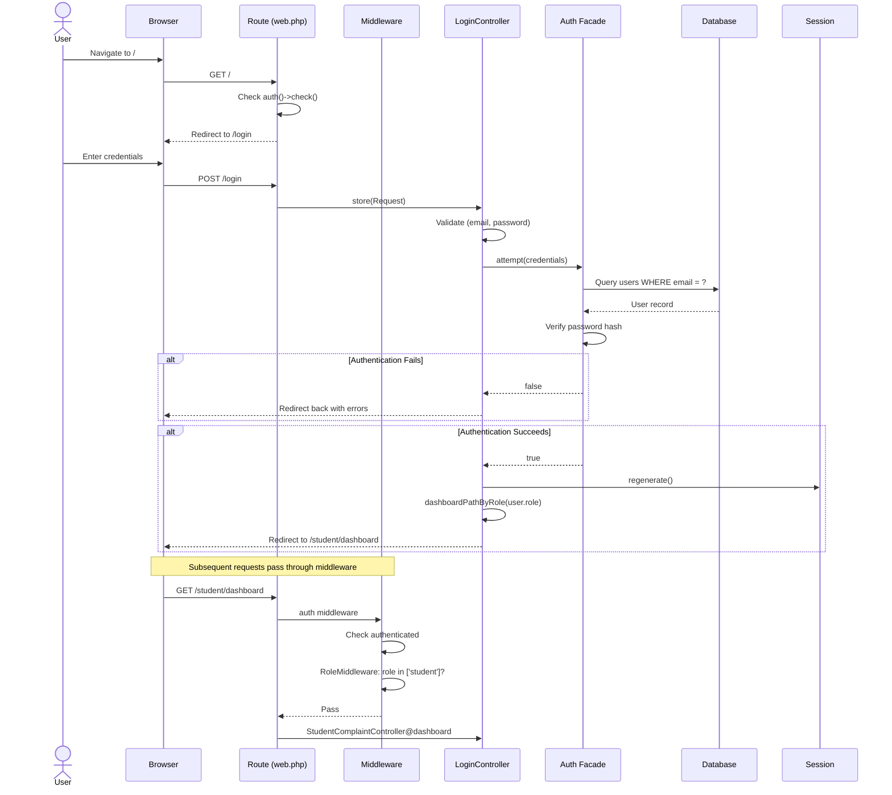

---

# Section 5 - Database Analysis

## Database Schema Overview

The system uses **12 migration files** producing **14 application tables** plus infrastructure tables.

### Application Tables

| Table | Purpose | Records (Seed) |
|-------|---------|----------------|
| `users` | All system users (students, staff, admins) | 1 (admin) |
| `departments` | Organizational departments (IT, Maintenance, etc.) | 5 |
| `categories` | Complaint categories with SLA hours | 8 |
| `complaints` | Core complaint records with status tracking | 0 |
| `complaint_comments` | Comments on complaints (internal/public) | 0 |
| `attachments` | File attachments for complaints and comments | 0 |
| `feedback` | Post-resolution complaint ratings | 0 |
| `activity_logs` | Audit trail for complaint status changes | 0 |
| `password_reset_tokens` | Password reset tokens (Fortify) | 0 |
| `sessions` | User session storage | Dynamic |

### Infrastructure Tables

| Table | Purpose |
|-------|---------|
| `cache` | Application cache storage |
| `cache_locks` | Cache lock management |
| `jobs` | Queue job storage |
| `job_batches` | Batch job metadata |
| `failed_jobs` | Failed queue job records |

---

## Detailed Table Schemas

### Table: `users`

| Column | Type | Nullable | Default | Description |
|--------|------|----------|---------|-------------|
| `id` | bigint (auto-increment) | No | — | Primary key |
| `name` | string | No | — | Full name |
| `email` | string (UNIQUE) | No | — | Login email |
| `email_verified_at` | timestamp | Yes | null | Email verification timestamp |
| `password` | string | No | — | Bcrypt-hashed password |
| `two_factor_secret` | text | Yes | null | Encrypted 2FA TOTP secret |
| `two_factor_recovery_codes` | text | Yes | null | Encrypted JSON array of recovery codes |
| `two_factor_confirmed_at` | timestamp | Yes | null | 2FA confirmation timestamp |
| `role` | enum(`student`,`staff`,`admin`) | No | `student` | User role for access control |
| `student_id` | string | Yes | null | Student identifier (students only) |
| `employee_id` | string | Yes | null | Employee identifier (staff only) |
| `phone` | string | Yes | null | Contact phone number |
| `department_id` | FK → departments(id) | Yes | null | Associated department (nullOnDelete) |
| `profile_photo` | string | Yes | null | Profile photo file path |
| `is_active` | boolean | No | true | Account active status |
| `remember_token` | string(100) | Yes | null | "Remember me" token |
| `created_at` | timestamp | Yes | null | Creation timestamp |
| `updated_at` | timestamp | Yes | null | Last update timestamp |

### Table: `departments`

| Column | Type | Nullable | Default | Description |
|--------|------|----------|---------|-------------|
| `id` | bigint (auto-increment) | No | — | Primary key |
| `name` | string | No | — | Department name |
| `description` | text | Yes | null | Department description |
| `is_active` | boolean | No | true | Whether department is active |
| `created_at` | timestamp | Yes | null | Creation timestamp |
| `updated_at` | timestamp | Yes | null | Last update timestamp |

### Table: `categories`

| Column | Type | Nullable | Default | Description |
|--------|------|----------|---------|-------------|
| `id` | bigint (auto-increment) | No | — | Primary key |
| `name` | string | No | — | Category name |
| `department_id` | FK → departments(id) | No | — | Parent department (restrict on delete) |
| `sla_hours` | integer | No | 48 | SLA resolution deadline in hours |
| `description` | text | Yes | null | Category description |
| `is_active` | boolean | No | true | Whether category is active |
| `created_at` | timestamp | Yes | null | Creation timestamp |
| `updated_at` | timestamp | Yes | null | Last update timestamp |

### Table: `complaints`

| Column | Type | Nullable | Default | Description |
|--------|------|----------|---------|-------------|
| `id` | bigint (auto-increment) | No | — | Primary key |
| `ticket_no` | string (UNIQUE) | No | — | Auto-generated ticket (CMP-XXXXXX) |
| `user_id` | FK → users(id) | No | — | Submitting student (restrict) |
| `category_id` | FK → categories(id) | No | — | Complaint category (restrict) |
| `department_id` | FK → departments(id) | No | — | Target department (restrict) |
| `assigned_to` | FK → users(id) | Yes | null | Assigned staff member (nullOnDelete) |
| `title` | string | No | — | Complaint title |
| `description` | text | No | — | Detailed description |
| `location` | string | Yes | null | Physical location of issue |
| `status` | enum (8 values) | No | `pending` | Current lifecycle status |
| `priority` | enum (4 values) | No | `medium` | Priority level |
| `due_date` | timestamp | Yes | null | SLA deadline (auto-calculated) |
| `resolved_at` | timestamp | Yes | null | Resolution timestamp |
| `created_at` | timestamp | Yes | null | Submission timestamp |
| `updated_at` | timestamp | Yes | null | Last update timestamp |

**Status enum values:** `pending`, `verified`, `assigned`, `in_progress`, `resolved`, `reopened`, `rejected`, `closed`

**Priority enum values:** `low`, `medium`, `high`, `critical`

### Table: `complaint_comments`

| Column | Type | Nullable | Default | Description |
|--------|------|----------|---------|-------------|
| `id` | bigint (auto-increment) | No | — | Primary key |
| `complaint_id` | FK → complaints(id) | No | — | Parent complaint (cascade on delete) |
| `user_id` | FK → users(id) | No | — | Comment author (restrict) |
| `body` | text | No | — | Comment text |
| `is_internal` | boolean | No | false | If true, hidden from students |
| `created_at` | timestamp | Yes | null | — |
| `updated_at` | timestamp | Yes | null | — |

### Table: `attachments`

| Column | Type | Nullable | Default | Description |
|--------|------|----------|---------|-------------|
| `id` | bigint (auto-increment) | No | — | Primary key |
| `complaint_id` | FK → complaints(id) | No | — | Parent complaint (cascade on delete) |
| `comment_id` | FK → complaint_comments(id) | Yes | null | Parent comment if any (nullOnDelete) |
| `file_name` | string | No | — | Original file name |
| `file_path` | string | No | — | Storage path |
| `file_type` | string | Yes | null | MIME type |
| `file_size_kb` | integer | Yes | null | File size in KB |
| `created_at` | timestamp | Yes | null | — |
| `updated_at` | timestamp | Yes | null | — |

### Table: `feedback`

| Column | Type | Nullable | Default | Description |
|--------|------|----------|---------|-------------|
| `id` | bigint (auto-increment) | No | — | Primary key |
| `complaint_id` | FK → complaints(id) | No | — | UNIQUE — one feedback per complaint (cascade) |
| `user_id` | FK → users(id) | No | — | Feedback author (restrict) |
| `rating` | unsignedTinyInteger | No | — | Numeric rating |
| `comment` | text | Yes | null | Optional feedback text |
| `is_resolved` | boolean | No | false | Whether user considers it resolved |
| `created_at` | timestamp | Yes | null | — |
| `updated_at` | timestamp | Yes | null | — |

### Table: `activity_logs`

| Column | Type | Nullable | Default | Description |
|--------|------|----------|---------|-------------|
| `id` | bigint (auto-increment) | No | — | Primary key |
| `complaint_id` | FK → complaints(id) | No | — | Related complaint (cascade on delete) |
| `user_id` | FK → users(id) | No | — | User who performed action (restrict) |
| `action` | string | No | — | Description of action taken |
| `old_status` | string | Yes | null | Previous status |
| `new_status` | string | Yes | null | New status |
| `note` | text | Yes | null | Optional note/explanation |
| `created_at` | timestamp | Yes | null | — |
| `updated_at` | timestamp | Yes | null | — |

---

## Seed Data

### Departments (5 records)

| Department | Description |
|-----------|-------------|
| IT Support | — |
| Maintenance | — |
| Hostel Office | — |
| Security | — |
| Housekeeping | — |

### Categories (8 records)

| Department | Category | SLA (hours) |
|-----------|----------|-------------|
| IT Support | Internet/WiFi | 24 |
| IT Support | Computer Lab | 48 |
| Maintenance | Electrical | 24 |
| Maintenance | Plumbing | 48 |
| Maintenance | Furniture | 72 |
| Hostel Office | Hostel Issue | 48 |
| Security | Security Concern | 12 |
| Housekeeping | Cleaning Request | 12 |

### Admin User (1 record)

| Field | Value |
|-------|-------|
| Name | Super Admin |
| Email | `admin@campus.com` |
| Password | `admin123` (bcrypt hashed) |
| Role | `admin` |

---

# Section 6 - Eloquent Relationships

## Entity Relationship Diagram

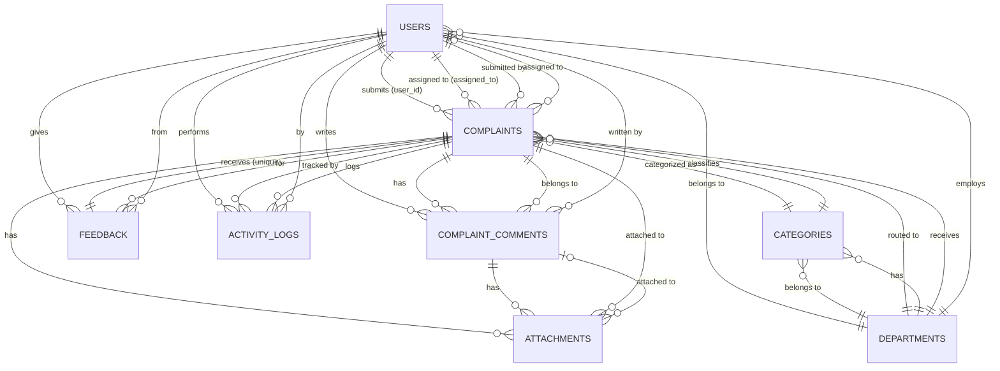

## Complete Relationship Map

### User Model Relationships

```
User
├── belongsTo    Department              (department_id → departments.id)
├── hasMany      Complaint (submitted)   (user_id)
├── hasMany      Complaint (assigned)    (assigned_to)
├── hasMany      ComplaintComment         (user_id)
├── hasMany      Feedback                (user_id)
└── hasMany      ActivityLog             (user_id)
```

**Why each relationship exists:**
- `department()` — Staff/admin users belong to a department for organizational hierarchy
- `submittedComplaints()` — Students submit complaints; this tracks ownership
- `assignedComplaints()` — Staff members are assigned complaints to resolve
- `complaintComments()` — Users write comments on complaints
- `feedbacks()` — Students provide feedback on resolved complaints
- `activityLogs()` — Every user action (status change, assignment) is logged

### Complaint Model Relationships

```
Complaint
├── belongsTo    User (submitter)        (user_id)
├── belongsTo    User (resolver)         (assigned_to)  [alias]
├── belongsTo    User (assignedTo)       (assigned_to)  [alias]
├── belongsTo    Category                (category_id)
├── belongsTo    Department              (department_id)
├── hasMany      ComplaintComment         (complaint_id)  [x2 aliases]
├── hasMany      Attachment              (complaint_id)
├── hasOne       Feedback                (complaint_id)
└── hasMany      ActivityLog             (complaint_id)
```

**Why each relationship exists:**
- `submitter()` — Tracks who filed the complaint
- `assignedTo()` / `resolver()` — Tracks the staff member working on it (two names, same FK)
- `category()` — Determines SLA hours and classification
- `department()` — Routes complaint to the correct organizational unit
- `comments()` — Discussion thread on the complaint
- `attachments()` — Supporting documents/images
- `feedback()` — HasOne (unique constraint) — exactly one feedback per complaint
- `activityLogs()` — Full audit trail of all changes

### Department Model Relationships

```
Department
├── hasMany      User                    (department_id)
├── hasMany      Category                (department_id)
└── hasMany      Complaint               (department_id)
```

### Category Model Relationships

```
Category
├── belongsTo    Department              (department_id)
└── hasMany      Complaint               (category_id)
```

### ComplaintComment Model Relationships

```
ComplaintComment
├── belongsTo    Complaint               (complaint_id)
├── belongsTo    User                    (user_id)
└── hasMany      Attachment              (comment_id)
```

**Special scope:** `scopePublicComments()` — Filters to `is_internal = false` (students only see public comments)

### Attachment Model Relationships

```
Attachment
├── belongsTo    Complaint               (complaint_id)
└── belongsTo    ComplaintComment         (comment_id)  [nullable]
```

### Feedback Model Relationships

```
Feedback
├── belongsTo    Complaint               (complaint_id)
└── belongsTo    User                    (user_id)
```

### ActivityLog Model Relationships

```
ActivityLog
├── belongsTo    Complaint               (complaint_id)
└── belongsTo    User                    (user_id)
```

---

# Section 7 - Controller Analysis

## Controller Summary Table

| Controller | Namespace | Methods | Status |
|-----------|-----------|---------|--------|
| `Controller` | `App\Http\Controllers` | — | Abstract base (empty) |
| `LoginController` | `Auth` | `create`, `store`, `destroy` | **Fully implemented** |
| `RegisterController` | `Auth` | `create`, `store` | **Fully implemented** |
| `ComplaintController` | `Admin` | `dashboard`, `index`, `show`, `assign`, `updateStatus` + 5 stubs | **Partially implemented** |
| `CategoryController` | `Admin` | `index`, `store` | **Fully implemented** |
| `DepartmentController` | `Admin` | `index`, `store` | **Fully implemented** |
| `ReportController` | `Admin` | `index` | **STUB** |
| `UserController` | `Admin` | `index` + 6 stubs | **Mostly stub** |
| `ComplaintController` | `Staff` | `dashboard`, `index`, `show`, `updateStatus` | **Fully implemented** |
| `ComplaintController` | `Student` | `dashboard`, `index`, `create`, `store`, `show` | **Fully implemented** |

---

## Detailed Controller Analysis

### Auth\LoginController

| Method | Input | Output | Description |
|--------|-------|--------|-------------|
| `create()` | — | `View` (`auth.login`) | Renders login page |
| `store(Request)` | email, password | `RedirectResponse` | Authenticates, redirects by role |
| `destroy(Request)` | — | `RedirectResponse` → `/login` | Logout, invalidate session |

**Business Logic:** `dashboardPathByRole()` maps `admin` → `/admin/dashboard`, `staff` → `/staff/dashboard`, default → `/student/dashboard`

### Auth\RegisterController

| Method | Input | Output | Description |
|--------|-------|--------|-------------|
| `create()` | — | `View` (`auth.register`) | Renders registration page |
| `store(Request)` | name, email, password, role, student_id?, employee_id? | `RedirectResponse` | Creates user, auto-login |

**Business Logic:**
- Role restricted to `student` or `staff` (admin cannot self-register)
- `student_id` required if role=student; `employee_id` required if role=staff
- Password bcrypt-hashed before storage
- Auto-login after registration

### Admin\ComplaintController

| Method | Input | Output | Description |
|--------|-------|--------|-------------|
| `dashboard()` | — | `View` | 5 stat counts + 10 recent complaints |
| `index(Request)` | ?status, ?category_id, ?department_id, ?priority | `View` | Multi-filter paginated list (15/page) |
| `show(Complaint)` | Route model binding | `View` | Full detail + assign form + status form |
| `assign(Request, Complaint)` | assigned_to (must be staff user) | `RedirectResponse` | Assign to staff + set SLA due date |
| `updateStatus(Request, Complaint)` | status, ?note | `RedirectResponse` | Change status + activity log |
| `create()` | — | Plain text | **STUB** |
| `store(Request)` | — | Redirect | **STUB** |
| `edit(Complaint)` | — | Plain text | **STUB** |
| `update(Request, Complaint)` | — | Redirect | **STUB** |
| `destroy(Complaint)` | — | Redirect | **STUB** |

**Key Business Logic — `assign()`:**
1. Validates `assigned_to` exists in users table AND has role `staff`
2. Saves old status
3. Updates complaint: `assigned_to`, `status = 'assigned'`, `due_date = now() + category.sla_hours`
4. Creates `ActivityLog` with action "Complaint assigned"

**Key Business Logic — `updateStatus()`:**
1. Validates status against 8 allowed values
2. If new status = `resolved` → sets `resolved_at = now()`, otherwise clears it
3. Creates `ActivityLog` with old/new status and optional note

### Staff\ComplaintController

| Method | Input | Output | Description |
|--------|-------|--------|-------------|
| `dashboard()` | — | `View` | 3 stats scoped to current user + 5 recent |
| `index(Request)` | ?status | `View` | Filtered list of assigned complaints (10/page) |
| `show(Complaint)` | Route model binding | `View` | Detail view (abort 403 if not assigned to user) |
| `updateStatus(Request, Complaint)` | status, ?note | `RedirectResponse` | Status limited to `in_progress` or `resolved` |

**Authorization:** Manual check — `(int)$complaint->assigned_to !== (int)auth()->id()` → `abort(403)`  
**Staff can only set:** `in_progress`, `resolved` (2 options, not the full 8)

### Student\ComplaintController

| Method | Input | Output | Description |
|--------|-------|--------|-------------|
| `dashboard()` | — | `View` | 4 stats scoped to current user + 5 recent |
| `index(Request)` | ?status | `View` | Filtered list of own complaints (10/page) |
| `create()` | — | `View` | Form with categories grouped by department |
| `store(Request)` | title, category_id, description, ?location, priority | `RedirectResponse` | Create complaint + activity log |
| `show(Complaint)` | Route model binding | `View` | Detail (Gate::authorize policy check) |

**Key Business Logic — `store()`:**
1. Validates input including `description min:20 chars`
2. Looks up category to get `department_id` and `sla_hours`
3. Creates complaint with auto-assigned `department_id`, `status = 'pending'`, `due_date = now() + sla_hours`
4. Creates `ActivityLog` entry: "Complaint submitted"

**Authorization:** Uses `Gate::authorize('view', $complaint)` → triggers `ComplaintPolicy@view` → checks `$complaint->user_id === $user->id`

**Comment visibility:** Uses `->publicComments()` scope — students only see non-internal comments

### Admin\CategoryController

| Method | Input | Output | Description |
|--------|-------|--------|-------------|
| `index()` | — | `View` | List categories with departments + create form |
| `store(Request)` | name, department_id, sla_hours, ?description, ?is_active | `RedirectResponse` | Create new category |

**Validation:** `sla_hours` → integer, min:1, max:720 (1 hour to 30 days)

### Admin\DepartmentController

| Method | Input | Output | Description |
|--------|-------|--------|-------------|
| `index()` | — | `View` | List departments + create form |
| `store(Request)` | name, ?description, ?is_active | `RedirectResponse` | Create new department |

**Note:** `is_active` defaults to `true` (opposite of Category which defaults to `false`)

### Admin\UserController

| Method | Input | Output | Description |
|--------|-------|--------|-------------|
| `index()` | — | `View` | Paginated user list (15/page) |
| All others | — | Plain text / Redirect | **ALL STUBS** |

### Admin\ReportController

| Method | Input | Output | Description |
|--------|-------|--------|-------------|
| `index()` | — | Plain text | **STUB — "Admin Reports"** |

---

# Section 8 - Blade View Analysis

## Layout Hierarchy

The project has **two layout systems** that operate independently:

### System 1: Role-Based Layouts (Traditional Blade)
```
layouts/app.blade.php          ← Master HTML shell ("CampusTrack" brand)
├── layouts/admin.blade.php    ← Admin sidebar + @yield('admin-content')
├── layouts/staff.blade.php    ← Staff sidebar + @yield('staff-content')
└── layouts/student.blade.php  ← Student sidebar + @yield('student-content')
```

### System 2: Flux Component Layouts (Livewire/Starter Kit)
```
layouts/app/header.blade.php   ← Flux header layout (settings pages)
layouts/app/sidebar.blade.php  ← Flux sidebar layout (dashboard placeholder)
layouts/auth/simple.blade.php  ← Simple centered auth form
layouts/auth/card.blade.php    ← Card-style auth form
layouts/auth/split.blade.php   ← Split view with branding
```

## Complete View Inventory

### Admin Views (5 files)

| View | Layout | Route | Controller | Data Passed | User Actions |
|------|--------|-------|------------|-------------|-------------|
| `admin/dashboard` | `layouts.admin` | `admin.dashboard` | `Admin\ComplaintController@dashboard` | `$stats` (5 counts), `$recentComplaints` | View complaint links |
| `admin/complaints/index` | `layouts.admin` | `admin.complaints.index` | `Admin\ComplaintController@index` | `$complaints` (paginated), `$filters`, `$statuses`, `$categories`, `$departments`, `$priorities` | Filter, View, Assign |
| `admin/complaints/show` | `layouts.admin` | `admin.complaints.show` | `Admin\ComplaintController@show` | `$complaint` (eager-loaded), `$staffUsers`, `$statuses` | Assign staff, Update status |
| `admin/departments/index` | `layouts.admin` | `admin.departments.index` | `Admin\DepartmentController@index` | `$departments` (paginated) | Create department |
| `admin/users/index` | `layouts.admin` | `admin.users.index` | `Admin\UserController@index` | `$users` (paginated) | View only |
| `admin/categories/index` | `layouts.admin` | `admin.categories.index` | `Admin\CategoryController@index` | `$categories` (paginated), `$departments` | Create category |

### Staff Views (3 files)

| View | Layout | Route | Controller | Data Passed | User Actions |
|------|--------|-------|------------|-------------|-------------|
| `staff/dashboard` | `layouts.staff` | `staff.dashboard` | `Staff\ComplaintController@dashboard` | `$stats` (3 counts), `$recentComplaints` | View complaint links |
| `staff/complaints/index` | `layouts.staff` | `staff.complaints.index` | `Staff\ComplaintController@index` | `$complaints` (paginated), `$statuses`, `$status` | Filter, View |
| `staff/complaints/show` | `layouts.staff` | `staff.complaints.show` | `Staff\ComplaintController@show` | `$complaint`, `$statusOptions` | Update status (in_progress/resolved) |

### Student Views (4 files)

| View | Layout | Route | Controller | Data Passed | User Actions |
|------|--------|-------|------------|-------------|-------------|
| `student/dashboard` | `layouts.student` | `student.dashboard` | `Student\ComplaintController@dashboard` | `$stats` (4 counts), `$complaints` (last 5) | View complaints, Submit new |
| `student/complaints/index` | `layouts.student` | `student.complaints.index` | `Student\ComplaintController@index` | `$complaints` (paginated), `$statuses`, `$status` | Filter, View, Submit new |
| `student/complaints/create` | `layouts.student` | `student.complaints.create` | `Student\ComplaintController@create` | `$categories` (grouped by department) | Submit complaint form |
| `student/complaints/show` | `layouts.student` | `student.complaints.show` | `Student\ComplaintController@show` | `$complaint` (eager-loaded) | View details + activity log |

### Auth Views (2 standalone + 7 Livewire)

| View | Type | Route | Purpose |
|------|------|-------|---------|
| `auth/login` | Standalone HTML (CDN Tailwind) | `/login` | Custom login form |
| `auth/register` | Standalone HTML (CDN Tailwind + Alpine) | `/register` | Custom registration with role selector |
| `livewire/auth/login` | Flux-based | Fortify `loginView` | Fortify login (alternate) |
| `livewire/auth/register` | Flux-based | Fortify `registerView` | Fortify register (alternate) |
| `livewire/auth/forgot-password` | Flux-based | `password.request` | Request password reset link |
| `livewire/auth/reset-password` | Flux-based | `password.reset` | Set new password |
| `livewire/auth/confirm-password` | Flux-based | `password.confirm` | Confirm password for sensitive actions |
| `livewire/auth/verify-email` | Flux-based | `verification.notice` | Email verification notice |
| `livewire/auth/two-factor-challenge` | Flux-based | `two-factor.login` | 2FA code entry (TOTP or recovery) |

### Settings Views (5 files)

| View | Livewire Component | Route | Purpose |
|------|-------------------|-------|---------|
| `livewire/settings/profile` | `Settings\Profile` | `profile.edit` | Update name/email, delete account |
| `livewire/settings/security` | `Settings\Security` | `security.edit` | Change password, manage 2FA |
| `livewire/settings/appearance` | `Settings\Appearance` | `appearance.edit` | Light/dark/system theme |
| `livewire/settings/delete-user-form` | `Settings\DeleteUserForm` | (nested) | Account deletion modal |
| `livewire/settings/two-factor/recovery-codes` | `TwoFactor\RecoveryCodes` | (nested) | View/regenerate 2FA recovery codes |

### Reusable Components (8 files)

| Component | Props | Purpose |
|-----------|-------|---------|
| `<x-status-badge>` | `status` | Color-coded status pill (8 colors) |
| `<x-priority-badge>` | `priority` | Color-coded priority pill (4 colors) |
| `<x-complaint-card>` | `complaint` | Clickable card for student dashboard |
| `<x-alert>` | `type`, `message` | Dismissible success/error/warning alert |
| `<x-action-message>` | `on` (event name) | "Saved." feedback on Livewire events |
| `<x-auth-header>` | `title`, `description` | Auth page header with heading |
| `<x-auth-session-status>` | `status` | Auth status message display |
| `<x-desktop-user-menu>` | — | Dropdown profile menu |

## Navigation Flow Diagram

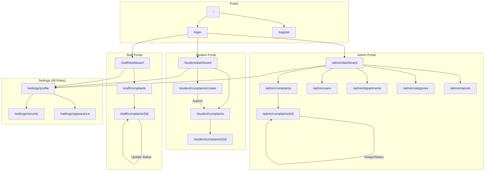

---

# Section 9 - Full Complaint Lifecycle

## End-to-End Flow

```mermaid
flowchart TD
    A["🎓 Student Opens Complaint Form"] --> B["Fills: Title, Category, Description, Location, Priority"]
    B --> C{"Validation Passes?"}
    C -->|No| B
    C -->|Yes| D["System Resolves department_id from category"]
    D --> E["System Calculates due_date = now + category.sla_hours"]
    E --> F["Auto-generates ticket_no = CMP-XXXXXX"]
    F --> G["INSERT complaints (status='pending')"]
    G --> H["INSERT activity_logs (action='Complaint submitted')"]
    H --> I["Redirect to complaints list with success"]

    I --> J["👨‍💼 Admin Sees Complaint on Dashboard"]
    J --> K["Admin Opens Complaint Detail"]
    K --> L["Admin Selects Staff Member"]
    L --> M{"Staff user valid?"}
    M -->|No| L
    M -->|Yes| N["UPDATE complaint: assigned_to, status='assigned'"]
    N --> O["Recalculate due_date = now + category.sla_hours"]
    O --> P["INSERT activity_logs (action='Complaint assigned')"]

    P --> Q["👷 Staff Sees Complaint in Dashboard"]
    Q --> R["Staff Opens Complaint"]
    R --> S["Staff Sets Status to 'in_progress'"]
    S --> T["INSERT activity_logs (action='Staff updated status')"]

    T --> U["Staff Resolves Issue"]
    U --> V["Staff Sets Status to 'resolved'"]
    V --> W["SET resolved_at = now()"]
    W --> X["INSERT activity_logs (action='Staff updated status')"]

    X --> Y["👨‍💼 Admin Reviews Resolution"]
    Y --> Z{"Satisfactory?"}
    Z -->|Yes| AA["Admin Sets Status to 'closed'"]
    Z -->|No| AB["Admin Sets Status to 'reopened'"]
    AB --> Q
    AA --> AC["✅ Complaint Lifecycle Complete"]

    style A fill:#e1f5fe
    style G fill:#fff3e0
    style N fill:#f3e5f5
    style V fill:#e8f5e9
    style AC fill:#c8e6c9
```

## Files Involved in Each Step

| Lifecycle Stage | Files Involved |
|----------------|----------------|
| **Student submits complaint** | `student/complaints/create.blade.php` → `Student\ComplaintController@store` → `Complaint` model (auto `ticket_no` in `boot()`) → `ActivityLog` model |
| **Validation** | `Student\ComplaintController@store` (inline `$request->validate()`) |
| **Database insertion** | `Complaint::create()` → `complaints` table; `ActivityLog::create()` → `activity_logs` table |
| **Admin views complaint** | `admin/complaints/index.blade.php`, `admin/complaints/show.blade.php` → `Admin\ComplaintController@index`, `@show` |
| **Admin assigns to staff** | `admin/complaints/show.blade.php` → `Admin\ComplaintController@assign` → `Complaint` update, `ActivityLog` creation |
| **Staff updates status** | `staff/complaints/show.blade.php` → `Staff\ComplaintController@updateStatus` → `Complaint` update, `ActivityLog` creation |
| **Resolution timestamp** | Set in `Staff\ComplaintController@updateStatus` or `Admin\ComplaintController@updateStatus` when status = `resolved` |
| **Final closure** | `Admin\ComplaintController@updateStatus` with status = `closed` |

## Status Transition Map

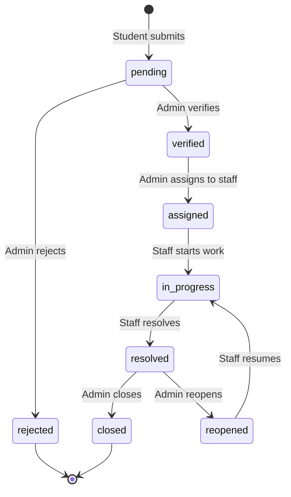

---

# Section 10 - Middleware Analysis

## Middleware Inventory

| Middleware | Class | Alias | Registration |
|-----------|-------|-------|--------------|
| Role Check | `App\Http\Middleware\RoleMiddleware` | `role` | `bootstrap/app.php` |
| Authentication | `Illuminate\Auth\Middleware\Authenticate` | `auth` | Laravel built-in |
| Email Verified | `Illuminate\Auth\Middleware\EnsureEmailIsVerified` | `verified` | Laravel built-in |
| Password Confirm | `Illuminate\Auth\Middleware\RequirePassword` | `password.confirm` | Laravel built-in |

## RoleMiddleware — Detailed Analysis

**File:** `app/Http/Middleware/RoleMiddleware.php` (26 lines)

```php
public function handle(Request $request, Closure $next, string ...$roles): Response
```

**Logic Flow:**
1. Gets authenticated user: `$user = auth()->user()`
2. If `$user` is `null` (guest) → `abort(403)`
3. If user's `role` is NOT in the allowed `$roles` array → `abort(403)`
4. Uses strict comparison: `in_array($user->role, $roles, true)`
5. If passed → calls `$next($request)`

**Key Points:**
- Supports multiple roles via variadic parameter: `role:admin,staff` would allow both
- Returns HTTP 403 (Forbidden), not 401 (Unauthorized) — the user may be authenticated but wrong role
- Does NOT redirect to login — that's handled by the `auth` middleware which runs first in the stack
- Always runs AFTER `auth` middleware in the route groups

**Protected Routes:**

| Middleware | Routes Protected |
|-----------|-----------------|
| `role:student` | All `/student/*` routes |
| `role:staff` | All `/staff/*` routes |
| `role:admin` | All `/admin/*` routes |
| `auth` | All role routes + `/settings/*` |
| `verified` | `/settings/appearance`, `/settings/security` |
| `password.confirm` | `/settings/security` (conditional, when 2FA confirmPassword enabled) |

## Middleware Execution Order

For a request to `/admin/complaints`:

```
1. web middleware group (session, CSRF, etc.)
2. auth → Verify user is logged in (redirect to /login if not)
3. role:admin → Verify user has 'admin' role (abort 403 if not)
4. Controller method executes
```

---

# Section 11 - Validation Rules

## Complete Validation Rules by Form

### Registration Form (`Auth\RegisterController@store`)

| Field | Rules | Rationale |
|-------|-------|-----------|
| `name` | required, string, max:255 | Standard name validation |
| `email` | required, email, max:255, unique:users,email | Prevent duplicate accounts |
| `password` | required, string, min:8, confirmed | Basic password strength + confirmation match |
| `role` | required, in:[student,staff] | Prevent admin self-registration |
| `student_id` | nullable, string, max:255, required_if:role,student | Required for student identification |
| `employee_id` | nullable, string, max:255, required_if:role,staff | Required for employee verification |

### Login Form (`Auth\LoginController@store`)

| Field | Rules | Rationale |
|-------|-------|-----------|
| `email` | required, email | Identify user |
| `password` | required, string | Authenticate user |

### Complaint Submission (`Student\ComplaintController@store`)

| Field | Rules | Rationale |
|-------|-------|-----------|
| `title` | required, string, max:255 | Brief complaint summary |
| `category_id` | required, integer, exists:categories,id | Must reference valid category |
| `description` | required, string, min:20 | Ensure sufficient detail for resolution |
| `location` | nullable, string, max:255 | Optional physical location |
| `priority` | required, in:[low,medium,high,critical] | Categorize urgency |

### Complaint Assignment (`Admin\ComplaintController@assign`)

| Field | Rules | Rationale |
|-------|-------|-----------|
| `assigned_to` | required, exists:users,id WHERE role='staff' | Must be a valid staff user |

### Status Update (`Admin\ComplaintController@updateStatus`)

| Field | Rules | Rationale |
|-------|-------|-----------|
| `status` | required, in:[pending,verified,assigned,in_progress,resolved,reopened,rejected,closed] | Must be valid status |
| `note` | nullable, string, max:1000 | Optional explanation for the change |

### Staff Status Update (`Staff\ComplaintController@updateStatus`)

| Field | Rules | Rationale |
|-------|-------|-----------|
| `status` | required, in:[in_progress,resolved] | Staff can ONLY set these 2 statuses |
| `note` | nullable, string, max:1000 | Optional update note |

### Department Creation (`Admin\DepartmentController@store`)

| Field | Rules | Rationale |
|-------|-------|-----------|
| `name` | required, string, max:255 | Department name |
| `description` | nullable, string | Optional description |
| `is_active` | nullable, boolean | Defaults to true if omitted |

### Category Creation (`Admin\CategoryController@store`)

| Field | Rules | Rationale |
|-------|-------|-----------|
| `name` | required, string, max:255 | Category name |
| `department_id` | required, integer, exists:departments,id | Must belong to valid department |
| `sla_hours` | required, integer, min:1, max:720 | 1 hour to 30 days SLA window |
| `description` | nullable, string | Optional description |
| `is_active` | nullable, boolean | Defaults to false if omitted |

### Profile Update (`Livewire\Settings\Profile`)

| Field | Rules | Rationale |
|-------|-------|-----------|
| `name` | required, string, max:255 | From `ProfileValidationRules` trait |
| `email` | required, string, email, max:255, unique:users (ignore current user) | From trait |

### Password Update (`Livewire\Settings\Security`)

| Field | Rules | Rationale |
|-------|-------|-----------|
| `current_password` | required, string, current_password | Verify identity |
| `password` | required, string, Password::default(), confirmed | New password with strength rules |

### 2FA Verification (`Livewire\Settings\Security`)

| Field | Rules | Rationale |
|-------|-------|-----------|
| `code` | required, string, size:6 | TOTP code is exactly 6 digits |

### Account Deletion (`Livewire\Settings\DeleteUserForm`)

| Field | Rules | Rationale |
|-------|-------|-----------|
| `password` | required, string, current_password | Confirm identity before irreversible action |

---

# Section 12 - Business Logic Map

## Core Business Rules

### 1. Role Access Matrix

| Action | Student | Staff | Admin |
|--------|---------|-------|-------|
| Submit complaint | ✅ | ❌ | ❌ (stub) |
| View own complaints | ✅ | — | — |
| View assigned complaints | — | ✅ | — |
| View all complaints | ❌ | ❌ | ✅ |
| Update status (limited) | ❌ | ✅ (2 statuses) | ✅ (all 8) |
| Assign complaints | ❌ | ❌ | ✅ |
| Manage departments | ❌ | ❌ | ✅ |
| Manage categories | ❌ | ❌ | ✅ |
| View all users | ❌ | ❌ | ✅ |
| Self-register | ✅ | ✅ | ❌ |

### 2. Ticket Number Generation

- **Format:** `CMP-XXXXXX` (6-digit zero-padded)
- **Algorithm:** `static::max('id') + 1` on the `creating` event
- **Example:** First complaint → `CMP-000001`, second → `CMP-000002`
- **Location:** `Complaint::boot()` method

### 3. SLA Calculation

- Each category has an `sla_hours` value (1-720 hours)
- **On complaint creation:** `due_date = now() + category.sla_hours`
- **On complaint assignment:** `due_date = now() + category.sla_hours` (recalculated)
- **Overdue detection:** Admin dashboard counts complaints where `due_date < now()` AND `status != 'closed'`

### 4. Department Auto-Assignment

- When a student selects a category, the system automatically looks up the category's `department_id`
- The complaint is routed to that department without the student needing to select it directly
- **Flow:** Student picks category → Controller finds `$category->department_id` → Sets `$complaint->department_id`

### 5. Comment Visibility

- Comments have an `is_internal` boolean flag
- **Students see:** Only `publicComments()` scope (`is_internal = false`)
- **Staff/Admin see:** All comments (no scope applied)
- **Purpose:** Staff can leave internal notes about complaints that students can't read

### 6. Feedback Uniqueness

- The `feedback` table has a UNIQUE constraint on `complaint_id`
- This enforces **exactly one feedback entry per complaint**
- The `Complaint` model uses `hasOne Feedback` relationship

### 7. Resolution Tracking

- When status changes to `resolved` → `resolved_at = now()`
- When status changes to anything else → `resolved_at = null`
- This means re-opening a resolved complaint clears the resolution timestamp

## Decision Tree — Status Transitions

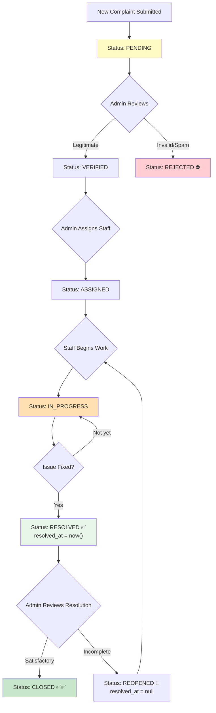

## Hidden Assumptions

1. **Admin accounts cannot be created via the UI** — Only through database seeders or direct DB manipulation
2. **No cascading department deactivation** — Deactivating a department doesn't deactivate its categories or complaints
3. **SLA is recalculated on assignment** — The initial SLA from creation gets overwritten when admin assigns
4. **Staff can only update complaints assigned to them** — Manual `abort(403)` check, not policy-based
5. **No email notifications** — Despite queue infrastructure being configured, no notification classes exist
6. **Attachment upload logic is missing** — The `attachments` table exists but no upload/download controllers or forms are implemented
7. **Comments functionality not fully wired** — The `complaint_comments` table and model exist, but no create/store comment routes or forms are implemented in the controllers

---

# Section 13 - User Journey Mapping

## Student Journey

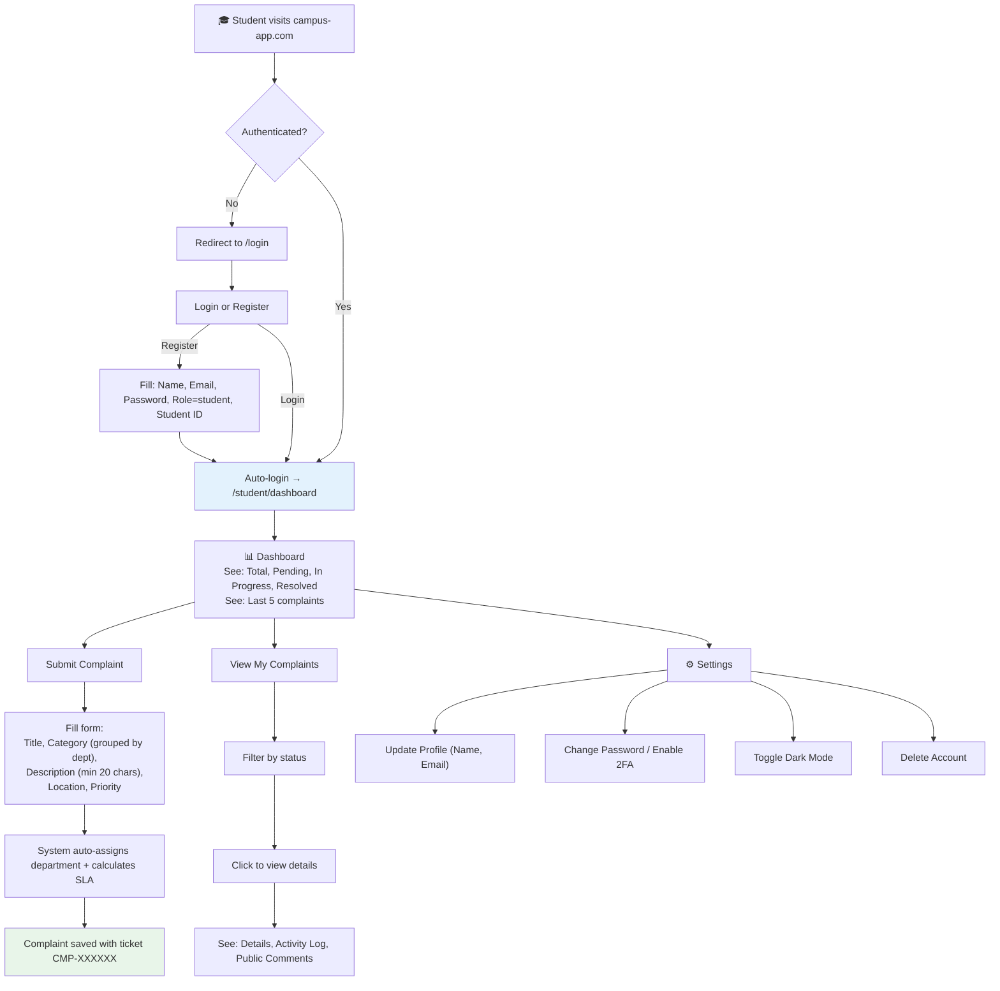

## Staff Journey

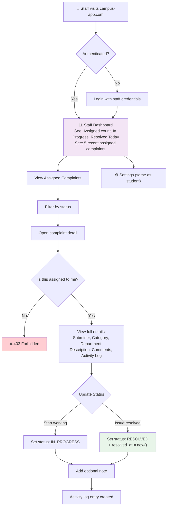

## Admin Journey

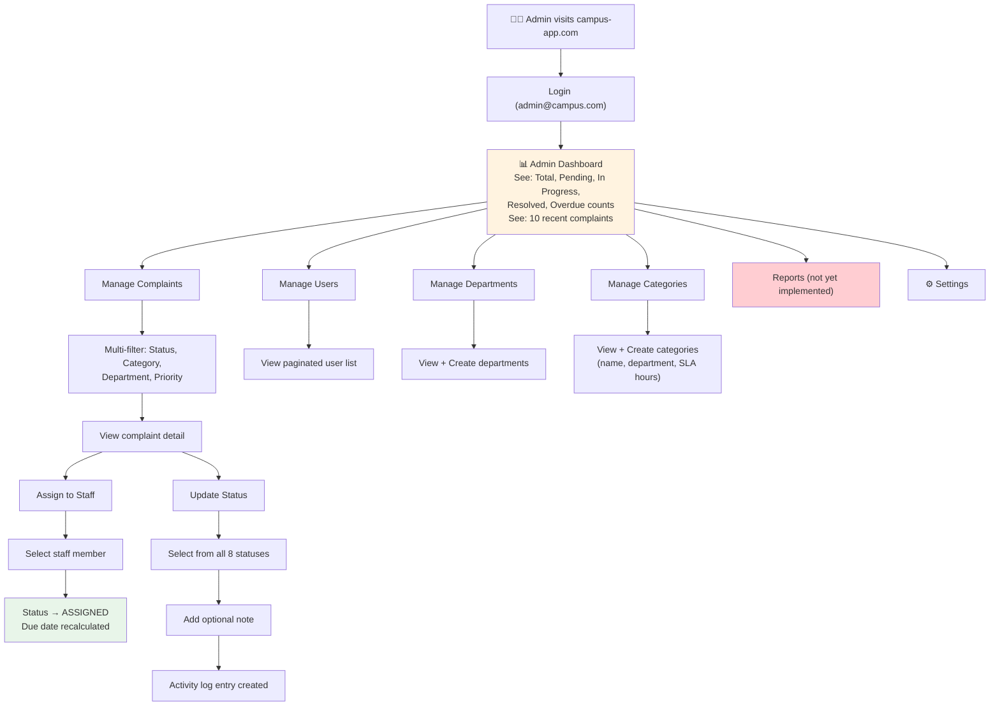

---

# Section 14 - System Flow Diagrams

## High-Level Architecture

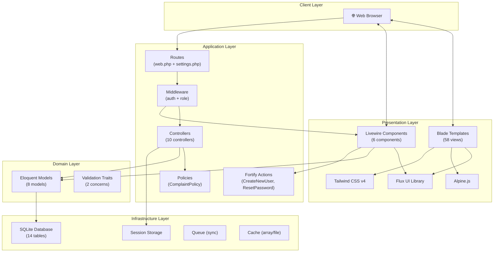

## Request Lifecycle

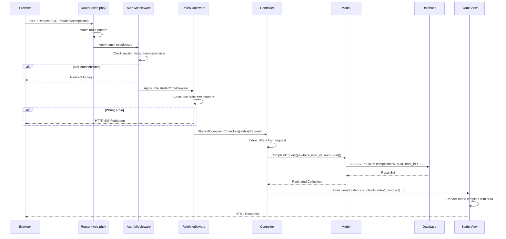

## Complaint Processing Flow

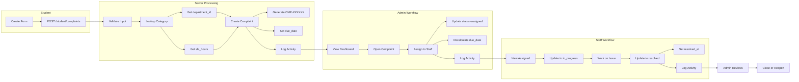

---

# Section 15 - Developer Onboarding Guide

## Prerequisites

| Tool | Version | Purpose |
|------|---------|---------|
| PHP | 8.3+ | Server-side runtime |
| Composer | 2.x | PHP dependency manager |
| Node.js | 18+ (LTS) | Frontend tooling |
| npm | 9+ | JavaScript package manager |
| SQLite | 3.x | Default database engine |
| Git | 2.x | Version control |

## Quick Setup (Fresh Clone)

```bash
# 1. Clone the repository
git clone <repo-url> campus-complaints-manager
cd campus-complaints-manager

# 2. Run the automated setup script
composer run setup
# This runs:
#   - composer install
#   - cp .env.example .env
#   - php artisan key:generate
#   - php artisan migrate --force
#   - npm install
#   - npm run build
```

> **⚠️ Important:** Flux UI requires authentication credentials. Before `composer install`, run:
> ```bash
> composer config http-basic.composer.fluxui.dev "$FLUX_USERNAME" "$FLUX_LICENSE_KEY"
> ```

## Running the Application Locally

```bash
# Start all 3 services concurrently (server + queue + Vite)
composer run dev

# This runs simultaneously:
#   - php artisan serve         (Laravel dev server on http://localhost:8000)
#   - php artisan queue:listen  (Queue worker)
#   - npm run dev               (Vite HMR dev server)
```

## Environment Variables (.env)

| Variable | Default | Purpose |
|----------|---------|---------|
| `APP_NAME` | Laravel | Application display name |
| `APP_ENV` | local | Environment (local/staging/production) |
| `APP_DEBUG` | true | Debug mode (disable in production!) |
| `APP_URL` | http://localhost | Base URL |
| `APP_KEY` | (generated) | Encryption key |
| `DB_CONNECTION` | sqlite | Database driver |
| `DB_DATABASE` | database/database.sqlite | SQLite file path |
| `SESSION_DRIVER` | database | Session storage (uses sessions table) |
| `CACHE_STORE` | database | Cache storage |
| `QUEUE_CONNECTION` | database | Queue driver |

## Database Operations

```bash
# Run all migrations
php artisan migrate

# Reset and re-migrate (destructive!)
php artisan migrate:fresh

# Seed the database with default data
php artisan db:seed
# Seeds: 5 departments, 8 categories, 1 admin user (admin@campus.com / admin123)

# Migration + seed in one command
php artisan migrate:fresh --seed

# Check migration status
php artisan migrate:status
```

## Default Login Credentials

| Role | Email | Password |
|------|-------|----------|
| Admin | `admin@campus.com` | `admin123` |
| Student | (self-register) | (your choice, min 8 chars) |
| Staff | (self-register) | (your choice, min 8 chars) |

## Common Artisan Commands

```bash
# List all registered routes
php artisan route:list

# Clear all caches
php artisan optimize:clear

# Open Tinker REPL for database exploration
php artisan tinker

# View real-time logs
php artisan pail
```

## Running Tests

```bash
# Run full test suite (lint + tests)
composer test

# Run tests only (skip lint)
./vendor/bin/pest

# Run specific test file
./vendor/bin/pest tests/Feature/Auth/AuthenticationTest.php

# Run tests matching a name pattern
./vendor/bin/pest --filter="login"

# Run only Feature tests
php artisan test --testsuite=Feature
```

## Code Style

```bash
# Auto-fix code style
composer lint

# Check code style (no changes)
composer lint:check
```

## Building for Production

```bash
# Build optimized frontend assets
npm run build

# Cache Laravel config/routes for production
php artisan config:cache
php artisan route:cache
php artisan view:cache
```

---

# Section 16 - File Importance Ranking

## Top 20 Files a New Developer Should Study First

| Rank | File | Importance | Reason |
|------|------|-----------|--------|
| 1 | `routes/web.php` | 🔴 Critical | **Entry point** — Maps every URL to every controller; understand the whole app structure at a glance |
| 2 | `app/Models/Complaint.php` | 🔴 Critical | **Core domain model** — All relationships, auto ticket generation, status/priority enums |
| 3 | `app/Models/User.php` | 🔴 Critical | **Central entity** — Role system, all relationships, 2FA support, department association |
| 4 | `app/Http/Controllers/Student/ComplaintController.php` | 🔴 Critical | **Primary user flow** — Complete complaint submission lifecycle from form to database |
| 5 | `app/Http/Controllers/Admin/ComplaintController.php` | 🔴 Critical | **Most complex controller** — Dashboard stats, assignment logic, status management |
| 6 | `app/Http/Middleware/RoleMiddleware.php` | 🔴 Critical | **Security core** — Role-based access control for entire application |
| 7 | `database/migrations/2026_03_25_120300_create_complaints_table.php` | 🟠 High | **Schema blueprint** — Defines all complaint fields, status/priority enums, foreign keys |
| 8 | `app/Http/Controllers/Staff/ComplaintController.php` | 🟠 High | **Staff workflow** — Assignment verification, limited status updates, scoped queries |
| 9 | `database/migrations/2026_03_25_120200_add_campus_fields_to_users_table.php` | 🟠 High | **User schema** — Role enum, student/employee IDs, department FK |
| 10 | `app/Http/Controllers/Auth/LoginController.php` | 🟠 High | **Auth flow** — Login/logout logic, role-based redirect |
| 11 | `app/Http/Controllers/Auth/RegisterController.php` | 🟠 High | **Registration flow** — Role-conditional validation, admin exclusion |
| 12 | `resources/views/layouts/admin.blade.php` | 🟠 High | **Layout pattern** — Sidebar navigation template repeated by all role layouts |
| 13 | `app/Policies/ComplaintPolicy.php` | 🟠 High | **Authorization** — Ownership verification for student complaint access |
| 14 | `app/Providers/AppServiceProvider.php` | 🟠 High | **Boot config** — Gate policy registration, password defaults, date immutability |
| 15 | `app/Providers/FortifyServiceProvider.php` | 🟠 High | **Auth config** — Fortify actions, view registration, rate limiting |
| 16 | `app/Models/Category.php` | 🟡 Medium | **SLA source** — `sla_hours` field drives due_date calculations |
| 17 | `app/Models/ActivityLog.php` | 🟡 Medium | **Audit model** — Records every complaint status transition |
| 18 | `bootstrap/app.php` | 🟡 Medium | **App bootstrap** — Middleware alias registration, routing config |
| 19 | `resources/views/student/complaints/create.blade.php` | 🟡 Medium | **Key form** — Category-grouped form with priority selection |
| 20 | `config/fortify.php` | 🟡 Medium | **Feature flags** — Enabled Fortify features (registration, 2FA, etc.) |

---

# Section 17 - Code Smells & Improvement Suggestions

## 🔴 Critical Issues

### 1. Stub Controllers (Incomplete Implementation)
**Files affected:** `Admin\ReportController`, `Admin\UserController` (6 of 7 methods), `Admin\ComplaintController` (create/store/edit/update/destroy)

**Problem:** These return plain text strings instead of views, giving unprofessional user experience.

**Recommendation:** Either implement the functionality or remove the routes. If intentionally deferred, return proper "Coming Soon" views with 501 status codes.

### 2. Missing Comment & Attachment Functionality
**Problem:** Models and database tables exist for `ComplaintComment` and `Attachment`, but there are **no routes, controller methods, or forms** to create them. The show views display comments/attachments that can never be created through the UI.

**Recommendation:** Implement comment creation forms in the complaint show views, and file upload handling for attachments.

### 3. No Email Notifications
**Problem:** Queue infrastructure is configured (`queue:listen` runs in dev), but no notification classes exist. Students aren't notified when their complaint status changes, and staff aren't notified of new assignments.

**Recommendation:** Create Laravel notification classes for key events:
- `ComplaintAssigned` (notify staff)
- `ComplaintStatusChanged` (notify student)
- `ComplaintOverdue` (notify admin)

### 4. Two Parallel Auth Systems
**Problem:** The project has both standalone auth controllers (`Auth\LoginController`, `Auth\RegisterController`) with CDN Tailwind views AND Fortify-integrated Livewire auth views. This creates confusion about which system is active.

**Recommendation:** Consolidate to one system. The Fortify/Livewire system is more feature-complete (2FA, password reset, email verification). Remove the standalone controllers and views, or clearly document their purpose.

## 🟠 Security Issues

### 5. Default Admin Credentials in Seeder
**File:** `database/seeders/AdminSeeder.php`

**Problem:** Admin password `admin123` is hardcoded and trivially guessable.

**Recommendation:** Generate a random password during seeding and display it once, or prompt for it during setup. At minimum, force password change on first login.

### 6. No CSRF on Standalone Auth Forms (Partial)
**Problem:** The standalone `auth/login.blade.php` and `auth/register.blade.php` use CDN-loaded Tailwind instead of Vite-compiled assets. While they do include `@csrf`, they bypass the Vite asset pipeline.

**Recommendation:** Migrate these to use Vite-compiled assets for consistent security headers and CSP compliance.

### 7. No Rate Limiting on Custom Auth Routes
**Problem:** The custom `/login` and `/register` POST routes through `LoginController` and `RegisterController` have **no rate limiting**. Only Fortify's auth routes have rate limiters configured.

**Recommendation:** Add `throttle:login` middleware to the custom login POST route.

## 🟡 Performance Issues

### 8. N+1 Query Potential in Admin Dashboard
**File:** `Admin\ComplaintController@dashboard`

**Problem:** `recentComplaints` eager loads 4 relationships, but individual stat counts run 5 separate `COUNT(*)` queries.

**Recommendation:** Combine stat queries into a single query using conditional aggregation:
```sql
SELECT
  COUNT(*) as total,
  SUM(CASE WHEN status = 'pending' THEN 1 ELSE 0 END) as pending,
  ...
FROM complaints
```

### 9. Ticket Number Generation Race Condition
**File:** `Complaint::boot()` — `static::max('id') + 1`

**Problem:** Under concurrent requests, two complaints could get the same ticket number since `max('id')` is not atomic. The UNIQUE constraint would cause one to fail.

**Recommendation:** Use a database sequence, UUID, or move ticket generation to a post-creation hook using the actual `id`.

## 🟡 Maintainability Issues

### 10. Duplicate Relationships in Complaint Model
**Problem:** `resolver()` and `assignedTo()` both point to `User` via `assigned_to`. Similarly, `complaintComments()` and `comments()` both point to `ComplaintComment`.

**Recommendation:** Remove duplicates. Keep `assignedTo()` (more descriptive) and `comments()` (shorter). Add `@deprecated` annotations if backwards compatibility is needed.

### 11. Hardcoded Status Arrays
**Problem:** The 8 status values and 4 priority values are repeated as plain arrays across multiple controllers (Admin, Staff, Student).

**Recommendation:** Define status/priority as PHP enums (PHP 8.1+):
```php
enum ComplaintStatus: string {
    case Pending = 'pending';
    case Verified = 'verified';
    // ...
}
```

### 12. Inconsistent Default Values
**Problem:** `DepartmentController@store` defaults `is_active` to `true`, but `CategoryController@store` defaults to `false`. This inconsistency could cause confusion.

**Recommendation:** Make both default to `true` (active) or document the design reasoning.

### 13. Manual Authorization in Staff Controller
**Problem:** `Staff\ComplaintController` uses manual `abort(403)` checks instead of a Policy.

**Recommendation:** Extend `ComplaintPolicy` with a `manage` or `updateStatus` method for staff authorization.

### 14. No Form Request Classes
**Problem:** All validation is inline in controllers, leading to repetition and harder testing.

**Recommendation:** Extract validation into Form Request classes for each form:
- `StoreComplaintRequest`
- `AssignComplaintRequest`
- `UpdateStatusRequest`
- `StoreCategoryRequest`
- `StoreDepartmentRequest`

### 15. Empty `app.js`
**Problem:** The JavaScript entry point is completely empty but still compiled by Vite.

**Recommendation:** Either add meaningful JS or remove from Vite config to reduce bundle size.

---

# Section 18 - Learning Guide

## Recommended Study Order

If you're the original developer returning after a long break, or a completely new developer, follow this exact learning path:

---

### Phase 1: Understand the Data (Database Layer)

**Start here because everything else builds on the database structure.**

| Step | File to Study | What You'll Learn |
|------|--------------|-------------------|
| 1.1 | `database/migrations/2026_03_25_120200_add_campus_fields_to_users_table.php` | User roles (student/staff/admin), campus-specific fields |
| 1.2 | `database/migrations/2026_03_25_120000_create_departments_table.php` | Department structure |
| 1.3 | `database/migrations/2026_03_25_120100_create_categories_table.php` | Categories with SLA hours, department FK |
| 1.4 | `database/migrations/2026_03_25_120300_create_complaints_table.php` | **Most important** — status enum, priority enum, all FKs |
| 1.5 | `database/migrations/2026_03_25_120400_create_complaint_comments_table.php` | Internal vs. public comments |
| 1.6 | `database/migrations/2026_03_25_120500_create_attachments_table.php` | File attachments (complaint + comment level) |
| 1.7 | `database/migrations/2026_03_25_120600_create_feedback_table.php` | One-per-complaint feedback with rating |
| 1.8 | `database/migrations/2026_03_25_120700_create_activity_logs_table.php` | Audit trail structure |
| 1.9 | `database/seeders/DatabaseSeeder.php` | Seed order and default data |

---

### Phase 2: Understand the Domain Objects (Models)

**Now that you know the tables, understand how Laravel represents them.**

| Step | File to Study | What You'll Learn |
|------|--------------|-------------------|
| 2.1 | `app/Models/User.php` | Fillable fields, relationships (6), initials method, 2FA support |
| 2.2 | `app/Models/Complaint.php` | **Core model** — Auto ticket_no generation, 11 relationships, casts |
| 2.3 | `app/Models/Department.php` | Simple model with 3 relationships |
| 2.4 | `app/Models/Category.php` | SLA hours source, department relationship |
| 2.5 | `app/Models/ComplaintComment.php` | `publicComments()` scope — critical for student visibility |
| 2.6 | `app/Models/ActivityLog.php` | Audit trail model |
| 2.7 | `app/Models/Attachment.php` | Dual FK (complaint + optional comment) |
| 2.8 | `app/Models/Feedback.php` | HasOne relationship (unique per complaint) |

---

### Phase 3: Understand the URL Structure (Routes)

**Routes connect URLs to code — this is your application's API surface.**

| Step | File to Study | What You'll Learn |
|------|--------------|-------------------|
| 3.1 | `routes/web.php` | Every URL, every controller, every middleware group |
| 3.2 | `routes/settings.php` | Livewire settings routes |
| 3.3 | `bootstrap/app.php` | How the `role` middleware alias is registered |

---

### Phase 4: Understand the Business Logic (Controllers)

**Controllers are where the action happens — validation, queries, redirects.**

| Step | File to Study | What You'll Learn |
|------|--------------|-------------------|
| 4.1 | `app/Http/Controllers/Student/ComplaintController.php` | **Start here** — complete CRUD cycle, SLA calculation, Gate authorization |
| 4.2 | `app/Http/Controllers/Admin/ComplaintController.php` | Most complex: dashboard stats, assignment, status management |
| 4.3 | `app/Http/Controllers/Staff/ComplaintController.php` | Scoped queries, manual authorization, limited status options |
| 4.4 | `app/Http/Controllers/Auth/LoginController.php` | Login flow, role-based redirect |
| 4.5 | `app/Http/Controllers/Auth/RegisterController.php` | Registration with role-conditional fields |
| 4.6 | `app/Http/Controllers/Admin/CategoryController.php` | Category CRUD with SLA config |
| 4.7 | `app/Http/Controllers/Admin/DepartmentController.php` | Department CRUD |

---

### Phase 5: Understand the UI (Views)

**Views are what users actually see. Study the layouts first, then specific pages.**

| Step | File to Study | What You'll Learn |
|------|--------------|-------------------|
| 5.1 | `resources/views/layouts/app.blade.php` | Master HTML shell |
| 5.2 | `resources/views/layouts/admin.blade.php` | Admin sidebar navigation pattern |
| 5.3 | `resources/views/student/complaints/create.blade.php` | Most complex form (grouped categories) |
| 5.4 | `resources/views/admin/complaints/show.blade.php` | Most complex view (assign + status + timeline) |
| 5.5 | `resources/views/components/status-badge.blade.php` | Reusable component pattern |
| 5.6 | `resources/views/components/priority-badge.blade.php` | Color-coding system |

---

### Phase 6: Understand Security (Middleware + Policies)

| Step | File to Study | What You'll Learn |
|------|--------------|-------------------|
| 6.1 | `app/Http/Middleware/RoleMiddleware.php` | Role enforcement mechanism |
| 6.2 | `app/Policies/ComplaintPolicy.php` | Ownership-based authorization |
| 6.3 | `app/Providers/AppServiceProvider.php` | Gate registration, password defaults |

---

### Phase 7: Understand the Extended Auth System (Fortify + Livewire)

| Step | File to Study | What You'll Learn |
|------|--------------|-------------------|
| 7.1 | `config/fortify.php` | Enabled features (2FA, email verification, etc.) |
| 7.2 | `app/Providers/FortifyServiceProvider.php` | View registration, rate limiting |
| 7.3 | `app/Actions/Fortify/CreateNewUser.php` | Fortify registration action |
| 7.4 | `app/Livewire/Settings/Security.php` | Most complex Livewire component (password + 2FA) |
| 7.5 | `app/Livewire/Settings/Profile.php` | Profile update with email re-verification |
| 7.6 | `app/Concerns/PasswordValidationRules.php` | Shared validation trait pattern |

---

## Quick Reference Card

```
┌─────────────────────────────────────────────────────────┐
│                  CAMPUS COMPLAINTS MANAGER               │
│                    Quick Reference Card                   │
├─────────────────────────────────────────────────────────┤
│                                                          │
│  ROLES:     student → staff → admin                      │
│  STATUSES:  pending → verified → assigned → in_progress  │
│             → resolved → closed  (+ reopened, rejected)  │
│  PRIORITIES: low / medium / high / critical              │
│  TICKET:    CMP-XXXXXX (auto-generated)                  │
│  SLA:       Category.sla_hours → Complaint.due_date      │
│                                                          │
│  DEFAULT ADMIN:  admin@campus.com / admin123             │
│                                                          │
│  START SERVER:   composer run dev                         │
│  RUN TESTS:      composer test                           │
│  FIX STYLE:      composer lint                           │
│  SEED DATA:      php artisan db:seed                     │
│                                                          │
│  KEY MODELS:     User, Complaint, Category, Department   │
│  KEY ROUTES:     routes/web.php (everything)             │
│  KEY MIDDLEWARE:  RoleMiddleware (role:X)                 │
│  KEY POLICY:     ComplaintPolicy (student ownership)     │
│                                                          │
└─────────────────────────────────────────────────────────┘
```

---

*End of PROJECT_KNOWLEDGE_BASE.md — This document was generated through exhaustive analysis of every file in the codebase. For questions or updates, refer to the specific file references linked throughout each section.*
