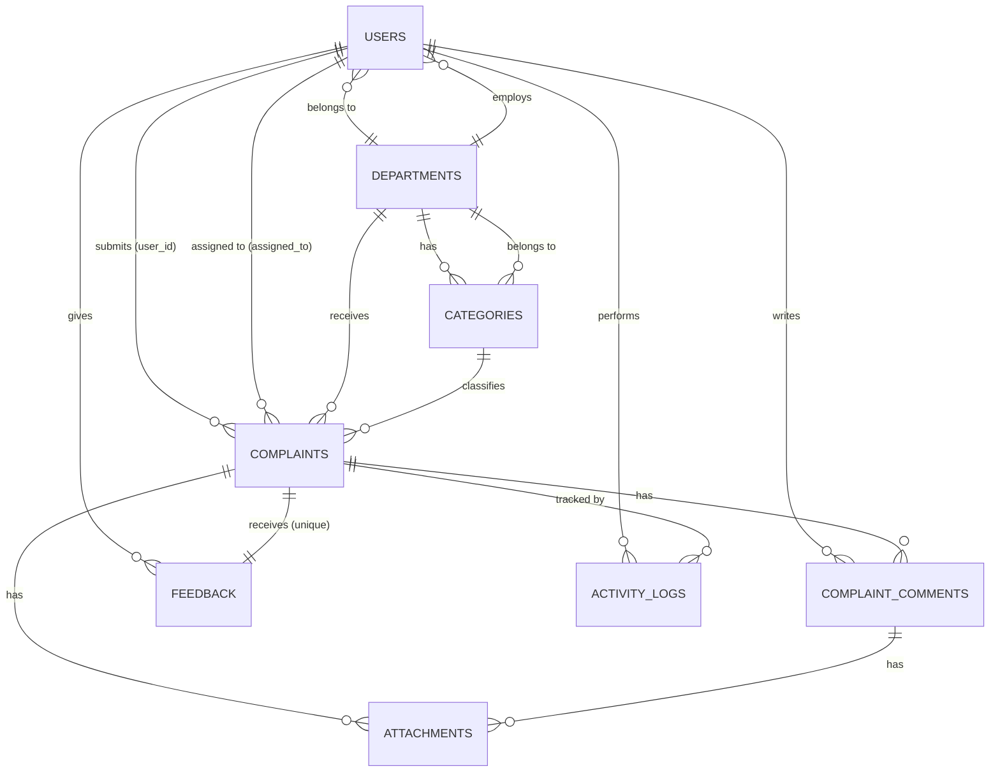
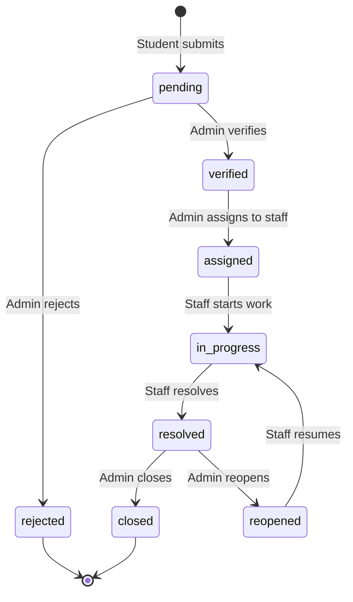

# 🎓 Campus Complaints Manager (CampusTrack)

A state-of-the-art, web-based campus complaint management platform built with Laravel 13, Livewire 4, and Flux UI. It enables university students to submit, track, and resolve campus-related complaints (IT, maintenance, security, hostel, housekeeping) while facilitating structured workflows for staff resolution and administrator oversight.

---

## 🛠️ Technology Stack

| Layer | Technology | Version | Purpose |
| :--- | :--- | :--- | :--- |
| **Backend Framework** | [Laravel](https://laravel.com) | `13.x` | Core application framework |
| **Language** | PHP | `8.3+` | Runtime language |
| **Frontend UI** | [Livewire](https://livewire.laravel.com) & [Flux](https://fluxui.dev) | `4.x` / `2.12.x` | Reactive PHP component rendering and pre-built interactive UI library |
| **CSS Framework** | [Tailwind CSS](https://tailwindcss.com) | `v4.x` | Modern utility-first CSS |
| **Interactivity** | [Alpine.js](https://alpinejs.dev) | (Bundled) | Micro-interactions and theme toggle |
| **Database** | SQLite | `3.x` | Fast, self-contained SQL database engine (development/testing) |
| **Testing** | [Pest PHP](https://pestphp.com) | `v4.x` | Modern, expressive PHP testing framework |
| **Styling theme** | Zinc Palette | Custom `@theme` | Curated dark mode & standard design system tokens |

---

## 🌟 Key Features

*   **Role-Based Access Control (RBAC):** Three distinct workspaces customized for:
    *   **Students:** Submit, view, and track details of their own complaints.
    *   **Staff:** View and resolve complaints assigned to their specific department.
    *   **Admins:** Oversee the entire system, assign tickets, manage categories, departments, and users.
*   **Structured Complaint Lifecycle:** A detailed, audited 8-stage transition flow (`pending` ➔ `verified` ➔ `assigned` ➔ `in_progress` ➔ `resolved` ➔ `closed` / `reopened` / `rejected`).
*   **Automatic SLA Tracking:** Automatically computes deadlines (`due_date`) based on category-specific SLA resolution hours (ranging from 12h for housekeeping to 72h for furniture).
*   **Activity Logging:** A robust audit trail registering every single status change, category update, or user assignment with optional transition notes.
*   **Two-Factor Authentication (2FA):** Secure TOTP-based authentication with recovery code generation via Fortify and Livewire.
*   **Internal Comments:** Staff and Admins can share internal-only notes on complaints that are hidden from the student.
*   **Feedback & Rating System:** Students can rate the resolution quality once a complaint is resolved.
*   **Vibrant Dark Mode:** Full system-wide theme switching (Light, Dark, and System Preferences) utilizing Flux and Alpine.js.

---

## 📐 System Architecture

### Database Schema Overview
The system tracks complaints, users, categories, and audit logs using a clean database schema:


### Status Transition Lifecycle
Complaints move through status states with strict authorization and automated due date recalculations:


---

## 📂 Key Codebase Files

*   **Routes Configuration:** 
    *   [routes/web.php](file:///c:/Users/NIPUN%20MADUTHA/Desktop/laravel/campus-complaints-manager/routes/web.php) — Manages auth, student, staff, and admin route routing and controllers.
    *   [routes/settings.php](file:///c:/Users/NIPUN%20MADUTHA/Desktop/laravel/campus-complaints-manager/routes/settings.php) — Livewire reactive setting routes.
*   **Domain Models:**
    *   [app/Models/User.php](file:///c:/Users/NIPUN%20MADUTHA/Desktop/laravel/campus-complaints-manager/app/Models/User.php) — Represents system users (student, staff, admin), handles 2FA, photo profiles.
    *   [app/Models/Complaint.php](file:///c:/Users/NIPUN%20MADUTHA/Desktop/laravel/campus-complaints-manager/app/Models/Complaint.php) — Tracks core ticket fields, generates sequence number (`CMP-XXXXXX`), sets database casts.
*   **Controllers:**
    *   [app/Http/Controllers/Student/ComplaintController.php](file:///c:/Users/NIPUN%20MADUTHA/Desktop/laravel/campus-complaints-manager/app/Http/Controllers/Student/ComplaintController.php) — Custom student complaint submissions.
    *   [app/Http/Controllers/Staff/ComplaintController.php](file:///c:/Users/NIPUN%20MADUTHA/Desktop/laravel/campus-complaints-manager/app/Http/Controllers/Staff/ComplaintController.php) — Custom staff actions (limited transitions).
    *   [app/Http/Controllers/Admin/ComplaintController.php](file:///c:/Users/NIPUN%20MADUTHA/Desktop/laravel/campus-complaints-manager/app/Http/Controllers/Admin/ComplaintController.php) — Administrative dashboard, assignment, and status updates.
*   **Middleware & Policies:**
    *   [app/Http/Middleware/RoleMiddleware.php](file:///c:/Users/NIPUN%20MADUTHA/Desktop/laravel/campus-complaints-manager/app/Http/Middleware/RoleMiddleware.php) — Enforces RBAC permissions checks.
    *   [app/Policies/ComplaintPolicy.php](file:///c:/Users/NIPUN%20MADUTHA/Desktop/laravel/campus-complaints-manager/app/Policies/ComplaintPolicy.php) — Limits resource views to authorized users.

---

## ⚡ Developer Setup Guide

### Prerequisites
*   **PHP** 8.3+
*   **Composer** 2.x
*   **Node.js** 18+ & **npm** 9+
*   **SQLite** 3.x

### First Time Setup
1.  **Configure Flux UI Credentials:**
    Flux is a premium UI toolkit. Set up authorization in Composer:
    ```bash
    composer config http-basic.composer.fluxui.dev "$FLUX_USERNAME" "$FLUX_LICENSE_KEY"
    ```
2.  **Run Automated Installer:**
    Use the automated setup script to build dependencies, environment variables, databases, and assets:
    ```bash
    composer run setup
    ```

3.  **Seed Default Records:**
    Run migrations and seed the SQLite database with starting departments, categories, and a super administrator:
    ```bash
    php artisan db:seed
    ```

### Run Locally
Launch three concurrent processes (Artisan web server, queue listener, and Vite hot-module replacement) using the following script:
```bash
composer run dev
```
*   **Web Server:** [http://localhost:8000](http://localhost:8000)
*   **Vite Assets Server:** [http://localhost:5173](http://localhost:5173)

### Default Administrator Credentials
*   **Email:** `admin@campus.com`
*   **Password:** `admin123`
*   *Note: Student and Staff roles can register freely via the UI.*

---

## 🧪 Testing, Quality & Code Style

The project relies on [Pest PHP](https://pestphp.com) for unit and feature test coverage.

```bash
# Run full suite (Pint lint check + Pest tests)
composer test

# Run tests directly (skipping Pint style check)
./vendor/bin/pest

# Run a specific test file
./vendor/bin/pest tests/Feature/Auth/AuthenticationTest.php

# Run tests matching a name pattern
./vendor/bin/pest --filter="login"
```

### Code Styling
Laravel Pint automatically maintains consistency with PSR-12 and Laravel guidelines:
```bash
# Automatically fix styling issues
composer lint

# Verify styling guidelines (Dry Run)
composer lint:check
```

---

> [!WARNING]
> **Production Recommendation:**
> Disable `APP_DEBUG` inside the production `.env` configuration. Ensure a secure random password is set for the Admin user in production, replacing the default `admin123` seed password.
